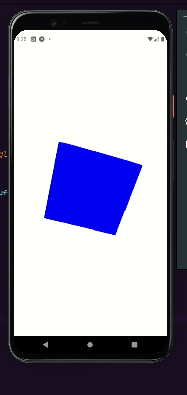

# 3D App

It's a cross-platform mobile application biult with react-native.

## About

<b>3d App</b> it's a cross-platform mobile app built with react-native in order to test the functioning of the threejs library in an react native application.

    Below, a gif that shows the app working:

## Installation

First you need to download this repository (or make a clone).
After that, you should <b>install</b> the <b>necessary dependencies</b> with a single command:

> yarn install

or

> npm install

## Running Application

To run this application, open a terminal window on the project root and execute:

> expo start
